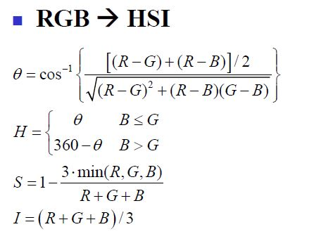
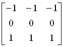
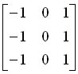
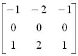
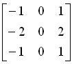
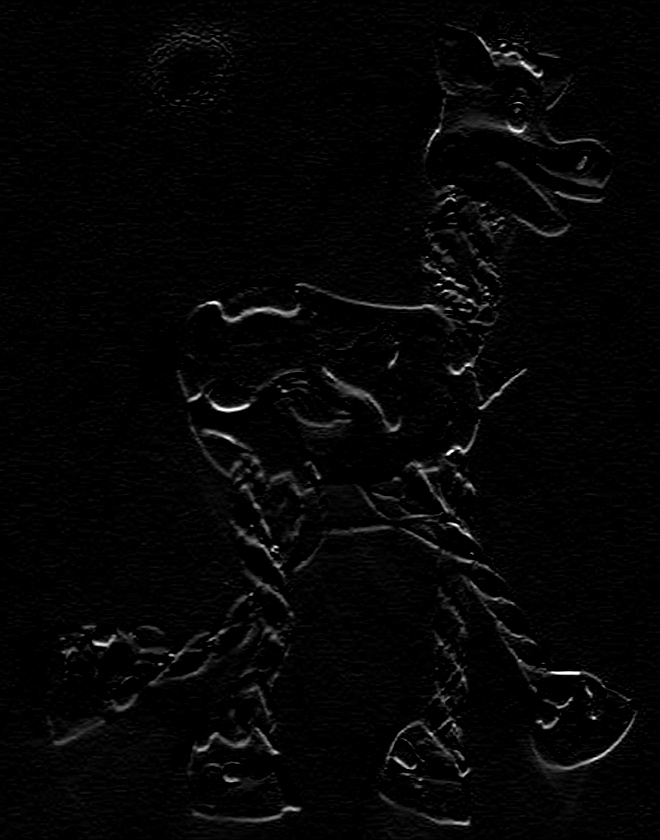
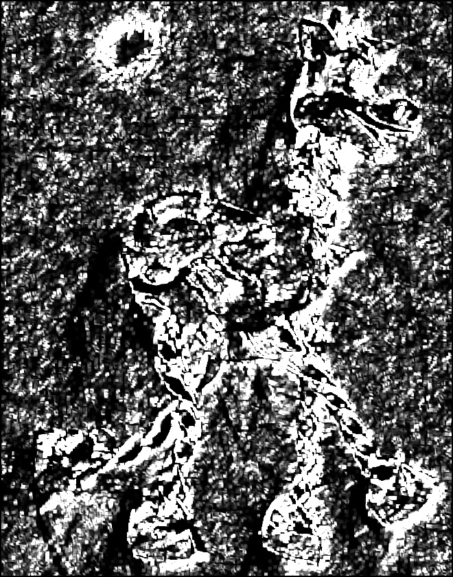
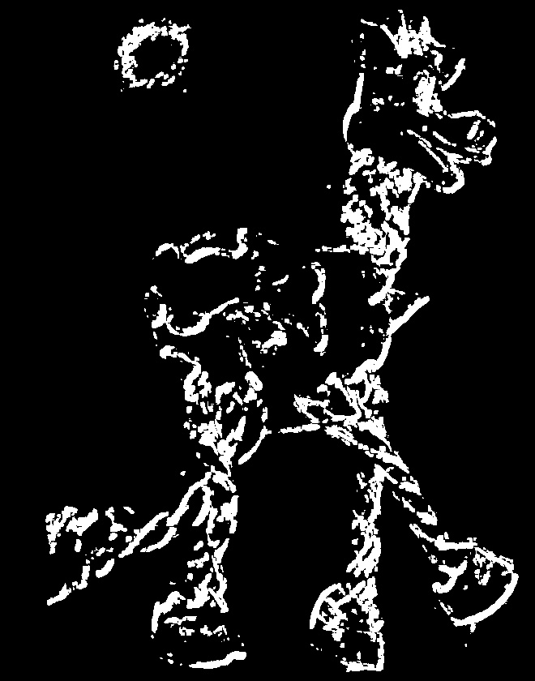

#Harris Corner

#### Harris Corner 角点检测

> 对输入的一张彩色图像，实现Harris Corner检
测算法

## 一、开发软件说明
### 开发环境
- Ubuntu 14.04
- cmake 2.8.12.2
- opencv 3.0

### 运行方式
- build project `make all`
- run `./harris_corner ./Resource/cv.png 0.02 4`

## 二、算法具体步骤
#### 2.1 根据原图计算每个点的Intensity
- 读入的图片位于RGB色彩空间，需要先将其转入HSI色彩空间
- RGB与HSI之间的转换公式如下

#### 2.2 计算每个点的Ix, Iy
- 利用微分算子进行卷积，求出Ix, Iy
- Prewitt算子
	- 水平方向 
	- 垂直方向 
- Sobel算子
	- 水平方向 
	- 垂直方向 
	
#### 2.3 根据矩阵Ix, Iy计算矩阵M
- 矩阵M的计算公式

#### 2.4 计算矩阵M的最大特征值Le和最小特征值Se
#### 2.5 根据矩阵Le和Se计算矩阵R
- 矩阵R的计算公式

#### 2.6 过滤R值
- 设置一个阈值过滤R值
- 在局部区域内取R值最大的点就是检测出的角点

#### 2.7 将结果与原图混合输出

## 三、算法实现要点
#### 3.1 计算Intensity矩阵

#### 3.2 计算Ix, Iy

#### 3.3 计算矩阵M，Le，Se，R

#### 3.4 过滤R值

#### 3.5 混合输出

## 四、实验结果展示及分析
#### 4.1 待检测的原图

#### 4.2 灰度图

#### 4.3 Ix

#### 4.4 Iy

#### 4.5 Le

#### 4.6 Se

#### 4.7 R

#### 4.8 过滤后的R

#### 4.9 叠加后

